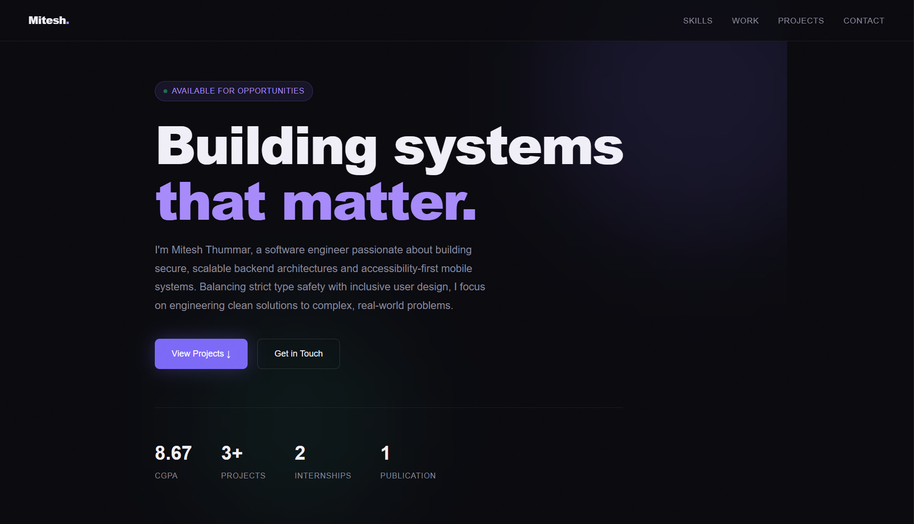
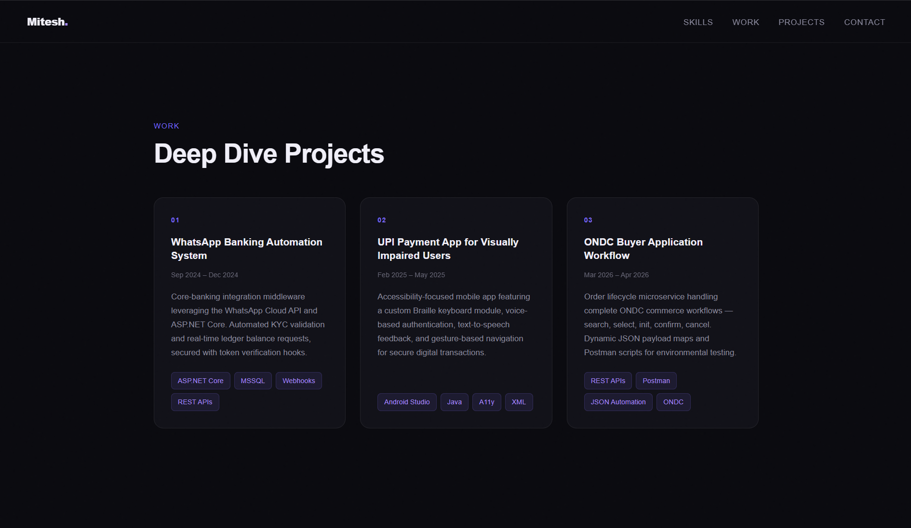

# 🧑‍💻 Mitesh Thummar — Portfolio

> A modern, editor-themed personal portfolio built with pure HTML & CSS. Zero dependencies. Single file. Deploy anywhere.

---

## 🖥️ Preview

### Hero


### Projects


---

## ✨ Features

- **VS Code–inspired UI** — sidebar icons, file tabs, breadcrumb bar, and live line numbers
- **Light cream theme** — warm `#FAF4E8` background with deep navy `#102542` typography
- **Scroll-driven interactions** — active tab, sidebar icon, and line numbers update as you scroll
- **Scroll progress bar** — thin navy gradient bar across the top
- **Hover effects** — cards lift with shadows, tags invert, timeline dots glow
- **Fade-up animations** — sections animate in as they enter the viewport
- **Fully responsive** — adapts cleanly to mobile screens
- **Zero dependencies** — single `index.html` file, no frameworks or build tools

---

## 🗂 Sections

| Section | Description |
|---|---|
| Hero | Intro, stats (CGPA, Projects, Internships, Publication) |
| Skills | Languages · Frontend · Backend · Databases · Tools |
| Experience | Trust Fintech Ltd · AsthaTech |
| Projects | WhatsApp Banking · UPI App · ONDC Workflow |
| Publication | Peer-reviewed research paper (2025) |
| Education | B.Tech SVPCET · 12th · 10th |
| Certifications | NPTEL · Leadership |
| Contact | Email · Phone · LinkedIn · GitHub |

---

## 🚀 Deploy

### GitHub Pages
```bash
# Create a repo named: yourusername.github.io
git init
git add index.html
git commit -m "initial portfolio"
git remote add origin https://github.com/yourusername/yourusername.github.io.git
git push -u origin main
```
Live at → `https://portfolio-git-main-mitesh-thummars-projects.vercel.app/`


### Vercel
```bash
npx vercel deploy
```

---

## 🎨 Color Palette

| Variable | Hex | Usage |
|---|---|---|
| `--page-bg` | `#FAF4E8` | Page background |
| `--surface` | `#F3EBDC` | Tab bar, gutter |
| `--ink` | `#102542` | Headings, primary text |
| `--muted` | `#4A5A6A` | Body text, descriptions |
| `--navy-mid` | `#3E7CB1` | Accents, tags, highlights |
| `--card-bg` | `#ffffff` | Cards |

---

## 🔧 Customisation

**Update your links** — find and replace in `index.html`:
```
https://www.linkedin.com/in/mitesh-thummar-840827262/?skipRedirect=true →  your LinkedIn profile URL
https://github.com/Mitesh4123  →  your GitHub profile URL
```

**Add a profile photo** — inside `#hero`, after `.hero-eyebrow`:
```html

```

**Add a new project** — copy any `.p-card` block inside `.projects-grid` and update the content.

---

## 📁 File Structure

```
portfolio/
├── index.html          ← entire portfolio (single file)
├── preview-hero.png    ← hero screenshot
├── preview-projects.png← projects screenshot
└── README.md           ← this file
```

---

## 📄 License

MIT — free to use and adapt with attribution.

---

<p align="center">
  Built by <strong>Mitesh Thummar</strong> · Nagpur, India · 2026
</p>
